# SentinelX SOC Lab — v1.0

> **Enterprise SOC Detection & Incident Response Lab**
>
> Wazuh SIEM · FastAPI · PostgreSQL 17 · React 18 / TypeScript · Docker · Active Response Containment

[](#22-testing)
[](#5-technology-stack)
[](#12-wazuh-setup)
[](LICENSE)

SentinelX is a fully-operational, end-to-end Security Operations Center (SOC) platform engineered for **defensive cybersecurity training, detection engineering practice, and portfolio demonstration**.
It ingests live security alerts from Wazuh SIEM, performs inline IOC extraction and MITRE ATT&CK enrichment, automates alert triage and campaign correlation, tracks incident lifecycles in a structured case management system with an evidence locker, and provides fail-closed, human-in-the-loop active response host containment — all orchestrated via Docker Compose.

---

## Table of Contents

1. [Project Overview](#1-project-overview)
2. [Problem Statement](#2-problem-statement)
3. [Key Capabilities](#3-key-capabilities)
4. [Architecture](#4-architecture)
5. [Technology Stack](#5-technology-stack)
6. [Repository Structure](#6-repository-structure)
7. [Prerequisites](#7-prerequisites)
8. [Environment Configuration](#8-environment-configuration)
9. [Application Startup](#9-application-startup)
10. [Database Migration](#10-database-migration)
11. [User Setup](#11-user-setup)
12. [Wazuh Setup](#12-wazuh-setup)
13. [Authentication & RBAC](#13-authentication--rbac)
14. [Alert Investigation](#14-alert-investigation)
15. [IOC Enrichment](#15-ioc-enrichment)
16. [MITRE ATT&CK](#16-mitre-attck)
17. [Triage](#17-triage)
18. [Case Management](#18-case-management)
19. [Evidence](#19-evidence)
20. [Dashboard](#20-dashboard)
21. [Active Response Safety Model](#21-active-response-safety-model)
22. [Testing](#22-testing)
23. [API Overview](#23-api-overview)
24. [Demo Workflow](#24-demo-workflow)
25. [Security Considerations](#25-security-considerations)
26. [Known Limitations](#26-known-limitations)
27. [Future Improvements](#27-future-improvements)

---

## Application Interface & Screenshots

All screenshots below represent the live, running SentinelX SOC platform.

| SOC Dashboard & Operational Analytics | Wazuh Alert Investigation & Telemetry |
|:---:|:---:|
| 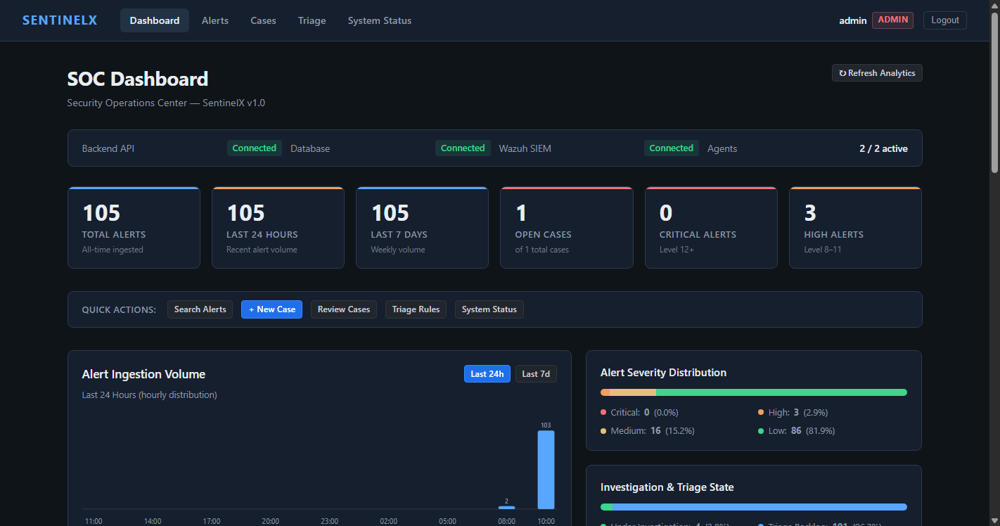 | 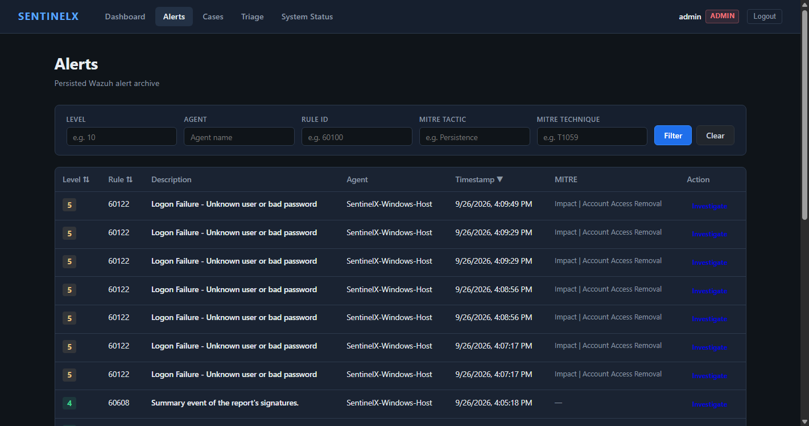 |

| Threat Intelligence & MITRE Enrichment | Incident Case Management |
|:---:|:---:|
| 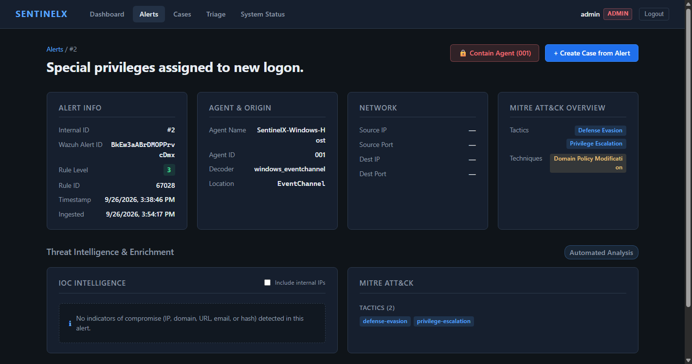 | 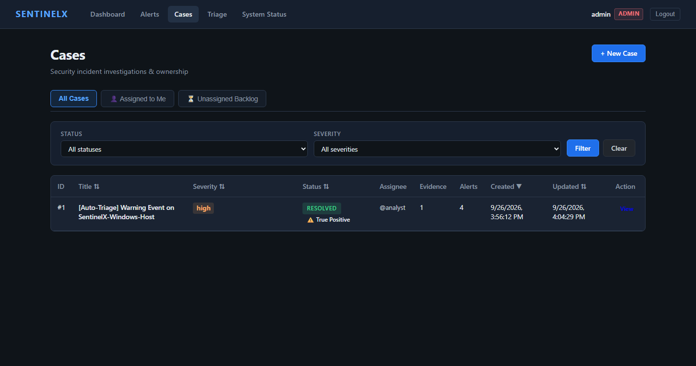 |

| Case Investigation & Audit Timeline | Evidence Locker & Artifact Catalog |
|:---:|:---:|
| 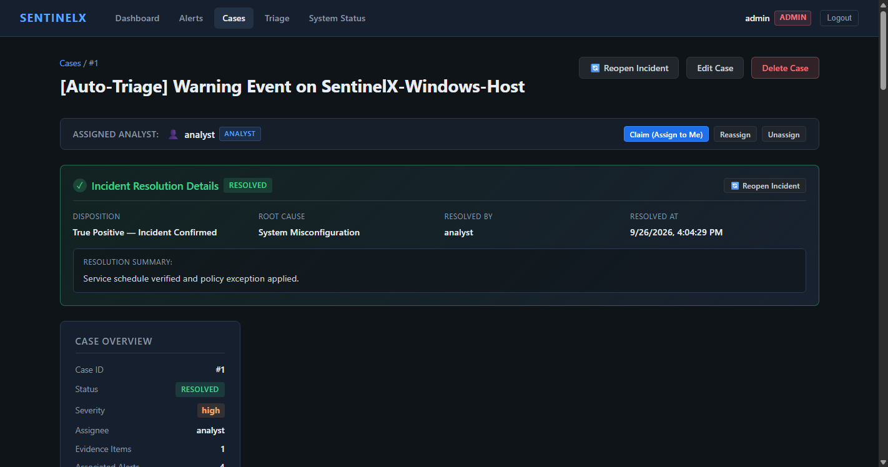 | 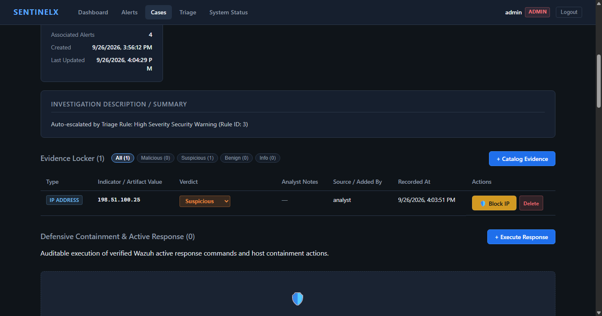 |

| Automated Alert Triage Policies | Controlled Active Response Modal |
|:---:|:---:|
| 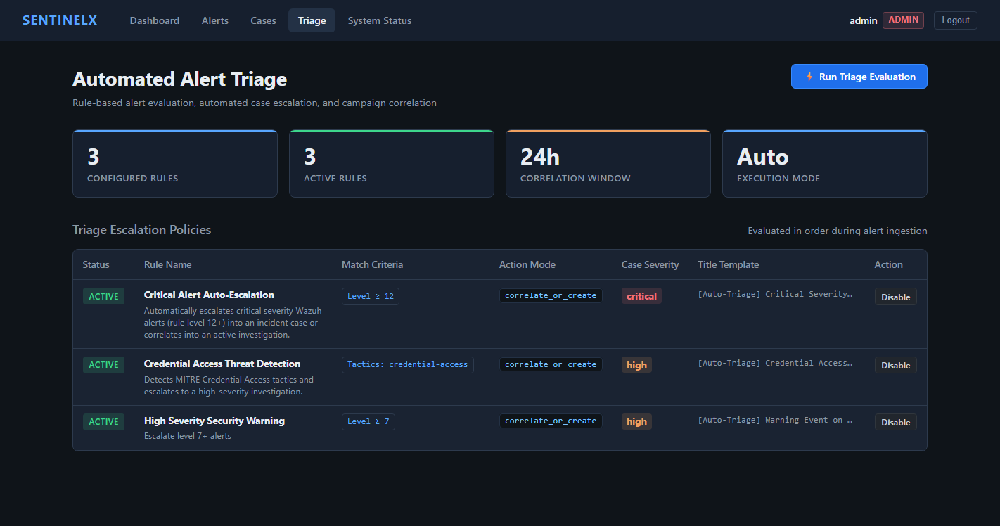 | 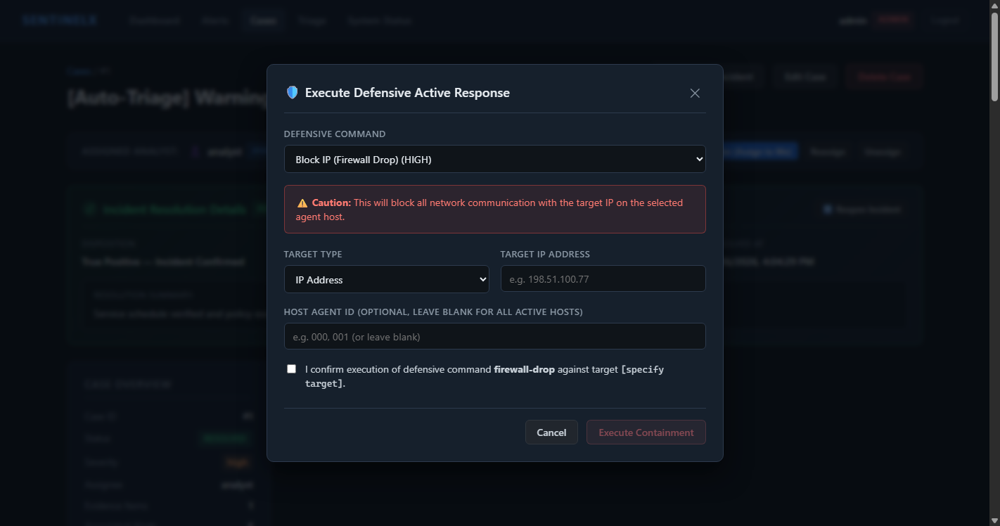 |

| Platform Login & Authentication | Integrated Wazuh SIEM Console |
|:---:|:---:|
| 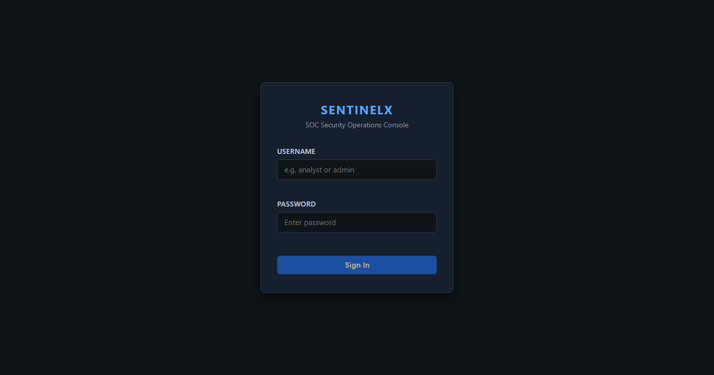 | 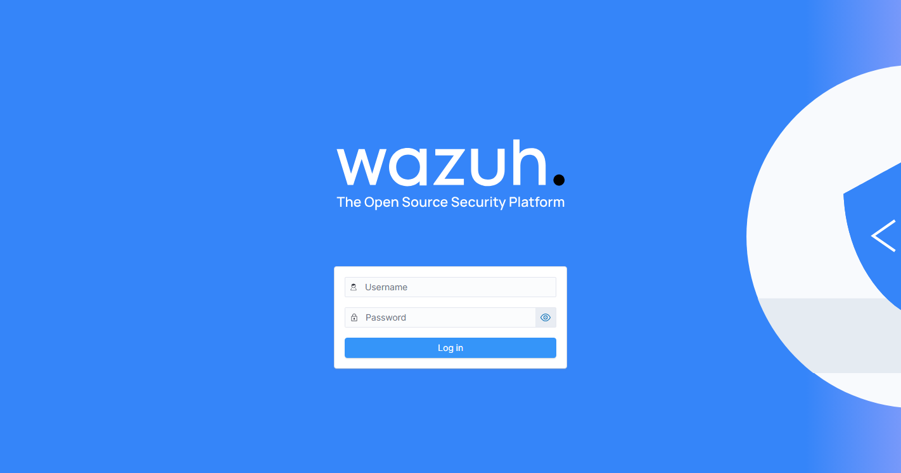 |

---

## 1. Project Overview

SentinelX provides a realistic, modular SOC platform bridging raw SIEM telemetry with defensive operational workflows. Rather than treating a SIEM as a passive log viewer, SentinelX implements a complete security operations workflow:

1. **Ingest** raw Wazuh alerts into a structured PostgreSQL schema with deduplication.
2. **Analyze** alerts through regex-based IOC extraction and MITRE ATT&CK enterprise mapping.
3. **Triage** alerts automatically into escalated incident cases with 24-hour host campaign correlation.
4. **Investigate** threats using rich filtering, chronological audit notes, analyst assignment, and an evidence locker.
5. **Contain** threats through verified, fail-closed Wazuh Active Response actions with mandatory human confirmation.

---

## 2. Problem Statement

Most hands-on SOC learning resources suffer from two extremes:
- **Trivial script tutorials:** Click-through exercises that lack real SIEM integration, background polling, or realistic data models.
- **Enterprise-scale deployments:** High-overhead platforms requiring dedicated hardware, proprietary licenses, and complex maintenance.

SentinelX solves this problem by delivering a complete, production-patterned SOC platform in a composable, containerized environment that can run entirely on a modern developer workstation.

---

## 3. Key Capabilities

| Capability | Status | Description |
|---|:---:|---|
| **Wazuh SIEM Ingestion** | ✅ Verified | Background scheduler polling Wazuh Indexer OpenSearch indices every 30s |
| **Alert Deduplication** | ✅ Verified | Idempotent ingestion keyed on unique `wazuh_alert_id` |
| **MITRE ATT&CK Mapping** | ✅ Verified | Automatic normalization and mapping of enterprise tactics and techniques |
| **IOC Extraction Engine** | ✅ Verified | Regex extraction for public IPv4, domain names, URLs, MD5, SHA1, and SHA256 hashes |
| **Alert Investigation Grid** | ✅ Verified | Multi-parameter filtering (severity, agent, rule, time window, MITRE) with pagination |
| **Incident Case Management** | ✅ Verified | Full case lifecycle (`open`, `in_progress`, `escalated`, `resolved`, `closed`) |
| **Analyst Work Queues** | ✅ Verified | Self-claiming, analyst assignment, and queue filtering |
| **Evidence Locker** | ✅ Verified | Artifact cataloging with analyst verdicts (`malicious`, `suspicious`, `benign`) |
| **Investigation Audit Trail** | ✅ Verified | Chronological, immutable case notes logging human and automated actions |
| **Automated Alert Triage** | ✅ Verified | Configurable rules evaluating severity, rule IDs, and MITRE tags with 24h correlation |
| **Structured Resolution** | ✅ Verified | Mandatory incident disposition, root cause categorization, and audit summary |
| **SOC Analytics Dashboard** | ✅ Verified | Real backend metrics: time series, severity distributions, top MITRE tags, IOCs |
| **Authentication & RBAC** | ✅ Verified | JWT HS256 authentication with bcrypt hashing (rounds=12) and role enforcement |
| **Controlled Active Response** | ✅ Verified | Fail-closed host containment with strict allowlist and anti-self-lockout safety |

---

## 4. Architecture

SentinelX uses a defense-in-depth, two-stack architecture orchestrated with Docker Compose:

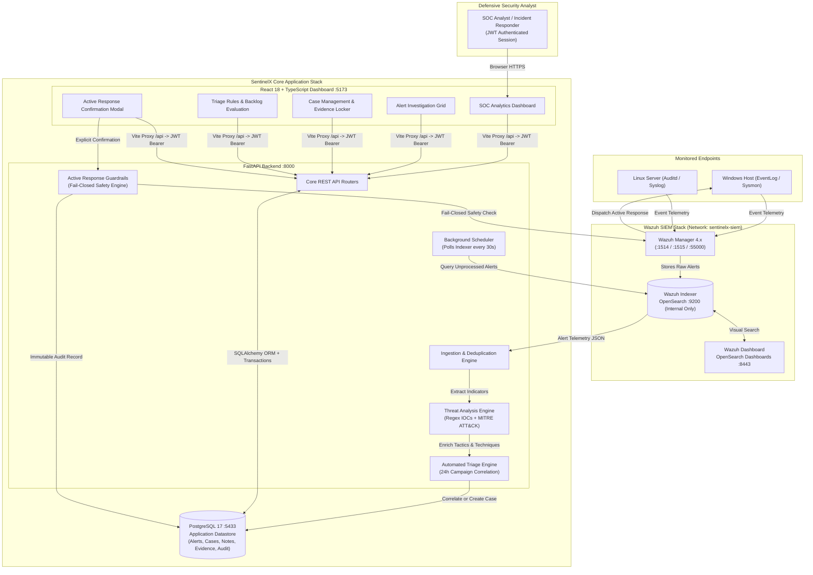

Detailed architectural diagrams and pipeline documentation are maintained under [`docs/architecture/overview.md`](docs/architecture/overview.md).

---

## 5. Technology Stack

| Layer | Component | Version | Role |
|---|---|---|---|
| **SIEM & Indexer** | Wazuh Manager | 4.14.8 | Agent management, rule evaluation, active response execution |
| | Wazuh Indexer | 4.14.8 | High-performance OpenSearch alert datastore |
| | Wazuh Dashboard | 4.14.8 | Visual OpenSearch search console (port 8443) |
| **Backend API** | Python / FastAPI | 3.13 / 0.118 | Async REST API, background scheduler, business logic |
| | SQLAlchemy | 2.0.54 | ORM mapping and PostgreSQL database session management |
| | Alembic | 1.20 | Reversible database migrations (7 revisions) |
| | PyJWT / bcrypt | 2.10 / 4.2 | JWT HS256 authentication and secure password hashing |
| | httpx | 0.28.1 | Async HTTP client for Wazuh Manager & Indexer communication |
| **Database** | PostgreSQL | 17 | Relational application datastore (cases, alerts, notes, evidence) |
| **Frontend UI** | React / TypeScript | 18.2 / 5.x | Responsive single-page application |
| | Vite | 8.3 | Build toolchain, reverse proxy, hot module reloading |
| **Testing** | pytest | 9.1 | Automated testing suite (272 tests) |
| **Containerization** | Docker Compose | v2 | Dual-stack network and volume orchestration |

---

## 6. Repository Structure

```text
sentinelx-soc/
├── .env.example                         # Documented environment variable template
├── .gitignore                           # Git ignore protecting secrets, certificates, and caches
├── docker-compose.yml                   # App stack: PostgreSQL, FastAPI backend, React frontend
├── LICENSE                              # Standard open-source MIT License
├── README.md                            # Comprehensive portfolio release documentation
│
├── automation/
│   └── playbooks/                       # Incident response SOPs (host containment, IP blocking)
│
├── backend/
│   ├── alembic/                         # Alembic migration scripts (7 revisions)
│   ├── app/
│   │   ├── analysis/                    # IOC extraction (IP, domain, URL, hash) & MITRE mapping
│   │   ├── api/                         # FastAPI routers: auth, alerts, cases, dashboard, triage, response
│   │   ├── core/                        # Security primitives: JWT issuance, verification, password hashing
│   │   ├── db/                          # SQLAlchemy session and database healthcheck
│   │   ├── models/                      # ORM models: Alert, Case, CaseNote, CaseEvidence, TriageRule, ResponseAction, User
│   │   ├── repositories/                # Data access layer (pure queries, no business logic)
│   │   ├── services/                    # Business logic: auth, case lifecycle, triage, containment
│   │   ├── wazuh/                       # Wazuh API client, OpenSearch queries, background scheduler
│   │   └── main.py                      # FastAPI application entrypoint and lifespan scheduler
│   ├── scripts/                         # Idempotent database seed scripts (seed_users, seed_triage_rules)
│   └── tests/                           # 272 automated unit, integration, and safety tests
│
├── docs/
│   ├── api/                             # Exported OpenAPI 3.1 JSON specification
│   ├── architecture/                    # In-depth architectural pipeline and network topology
│   ├── demo/                            # Step-by-step SOC demonstration walkthrough
│   ├── screenshots/                     # 10 verified application UI screenshots
│   └── setup/                           # Host environment and Wazuh bootstrapping guides
│
├── frontend/
│   ├── src/
│   │   ├── api/                         # Typed fetch client for backend endpoints and auth storage
│   │   ├── components/                  # Navigation, pagination, severity badges, modals, guards
│   │   ├── context/                     # AuthContext managing JWT state and role-aware routes
│   │   └── pages/                       # Dashboard, Alerts, AlertDetail, Cases, CaseDetail, Triage, Login
│   ├── package.json                     # Frontend dependencies and scripts
│   └── vite.config.ts                   # Vite configuration and backend API proxy
│
└── infrastructure/
    └── wazuh/                           # Wazuh single-node Docker stack, configs, and cert generator
```

---

## 7. Prerequisites

- **Docker Desktop** (WSL2 engine on Windows or native Docker on Linux) with Docker Compose v2.
- **System Memory:** Minimum 8 GB available to Docker (12–16 GB recommended when running both the App stack and Wazuh stack concurrently).
- **Virtual Memory Configuration (WSL2 / Linux):**
  ```bash
  sudo sysctl -w vm.max_map_count=262144
  ```

---

## 8. Environment Configuration

1. Copy the template to `.env`:
   ```bash
   cp .env.example .env
   ```

2. Generate a secure 256-bit secret key for JWT signing:
   ```bash
   python -c "import secrets; print(secrets.token_hex(32))"
   ```

3. Populate required values in `.env`:

| Parameter | Required | Default / Example | Purpose |
|---|:---:|---|---|
| `JWT_SECRET_KEY` | ✅ | `hex_token` | Secret key for HS256 JWT signature verification |
| `DEFAULT_ADMIN_PASSWORD` | ✅ | `YourAdminPass!` | Initial password for the seeded `admin` account |
| `DEFAULT_ANALYST_PASSWORD` | Optional | `YourAnalystPass!` | Initial password for the seeded `analyst` account |
| `POSTGRES_PASSWORD` | ✅ | `YourDbPass!` | PostgreSQL application datastore password |
| `RESPONSE_ENABLED` | Optional | `false` | Master killswitch for Active Response (**fail-closed**) |
| `WAZUH_API_PASSWORD` | ✅ (Wazuh) | *Match config* | Plaintext password matching `wazuh-wui` hash |
| `WAZUH_INDEXER_PASSWORD` | ✅ (Wazuh) | *Match config* | Plaintext password matching `admin` hash in OpenSearch |
| `WAZUH_DASHBOARD_PASSWORD` | ✅ (Wazuh) | *Match config* | Plaintext password matching `kibanaserver` hash |

---

## 9. Application Startup

The application stack (PostgreSQL, FastAPI backend, React frontend) can boot independently:

```bash
# 1. Build and start application containers
docker compose up -d --build

# 2. Check container health
docker compose ps
```

Health check endpoints:
- Application Root: http://127.0.0.1:8000/health
- API Health: http://127.0.0.1:8000/api/v1/health
- Database Connectivity: http://127.0.0.1:8000/api/v1/health/db
- Interactive Swagger UI: http://127.0.0.1:8000/docs
- Frontend Dashboard: http://127.0.0.1:5173

---

## 10. Database Migration

SentinelX manages schema versioning through 7 reversible Alembic migrations. Run against the healthy backend container:

```bash
# Apply all schema revisions to HEAD
docker compose exec backend alembic upgrade head

# Verify current revision
docker compose exec backend alembic current
```

Migration revisions:
1. `b1218046b63f` — Initial Alert and Case models
2. `c7e2d94a1b05` — Add `case_alerts` relationship table
3. `d8f3a1e5b204` — Add `users` table with password hashes and roles
4. `e1f34341c56e` — Add `case_notes` investigation audit timeline
5. `f3b5c719e204` — Add `triage_rules` automated escalation policies
6. `a8c9d1e2f304` — Add `case_evidence` artifact table and case lifecycle fields
7. `b9d1e2f3a405` — Add `response_actions` active response containment table (HEAD)

---

## 11. User Setup

Seed initial SOC operator accounts and baseline triage policies idempotently:

```bash
docker compose exec backend python -m scripts.seed_all
```

This creates:
- **Admin account:** username `admin`, email `admin@sentinelx.local`
- **Analyst account:** username `analyst`, email `analyst@sentinelx.local`
- **Baseline triage rules:** *Critical Alert Auto-Escalation* and *Credential Access Threat Detection*

---

## 12. Wazuh Setup

Wazuh runs in an isolated Compose project within `infrastructure/wazuh/`. Follow the staged startup order:

```bash
# Step 1: Generate self-signed cluster TLS certificates
docker compose -f infrastructure/wazuh/generate-indexer-certs.yml --env-file .env run --rm generator

# Step 2: Start Wazuh Indexer (OpenSearch)
docker compose -f infrastructure/wazuh/docker-compose.yml --env-file .env up -d wazuh.indexer

# Step 3: Wait 30s for Indexer health, then start Wazuh Manager
docker compose -f infrastructure/wazuh/docker-compose.yml --env-file .env up -d wazuh.manager

# Step 4: Start Wazuh Dashboard
docker compose -f infrastructure/wazuh/docker-compose.yml --env-file .env up -d wazuh.dashboard
```

Endpoints once healthy:
- **Wazuh Dashboard:** https://127.0.0.1:8443 (Accept self-signed TLS certificate)
- **Wazuh Manager API:** https://127.0.0.1:55000 (Internal to backend / host CLI)
- **Agent Enrollment:** Ports `1514` and `1515`

> **Decoupled Architecture:** If Wazuh is stopped, SentinelX degrades gracefully: `/api/v1/wazuh/*` returns `502 Bad Gateway`, while case management, triage, and alert investigation remain fully available.

---

## 13. Authentication & RBAC

All endpoints (excluding public health checks and `/api/v1/auth/login`) require a valid JWT Bearer token:

```bash
# Obtain JWT access token
curl -s -X POST http://127.0.0.1:8000/api/v1/auth/login \
  -H "Content-Type: application/json" \
  -d '{"username": "analyst", "password": "YourAnalystPassword"}' | jq .
```

Role enforcement:
- **`analyst`:** Full investigative access: alert querying, case creation/updating, note logging, evidence promotion, active response containment execution.
- **`admin`:** All analyst capabilities plus user management, case deletion, and triage rule mutation.

Passwords are cryptographically salted and hashed using `bcrypt` (12 rounds). Secrets and plaintext passwords are never committed to version control.

---

## 14. Alert Investigation

The background poller continuously queries the Wazuh Indexer OpenSearch index for new alerts every 30 seconds:

- **Idempotency:** Unique index constraint on `wazuh_alert_id` prevents duplicate insertion.
- **Normalization:** Standardizes timestamps, agent identifiers, rule levels (0–16), decoders, and event channel paths.
- **Filtering & Search:** The `GET /api/v1/alerts` endpoint provides granular queries:
  - Exact rule level or range (`min_rule_level`, `max_rule_level`)
  - Agent ID or name (`agent_id`, `agent_name`)
  - Rule identifier (`rule_id`)
  - MITRE tactic or technique (`mitre_tactic`, `mitre_technique`)
  - Time window bounds (`start_time`, `end_time` in ISO 8601 format)
  - Sorting and pagination (`page`, `page_size`, `sort_by`, `sort_order`)

---

## 15. IOC Enrichment

The inline Threat Analysis engine (`app/analysis/ioc.py`) automatically parses alert descriptions and raw event metadata using defensive regular expressions:

- **Public IPv4 Addresses:** Strict quad-octet matching with automatic filtering of RFC 1918 private ranges, loopback (`127.0.0.0/8`), multicast (`224.0.0.0/4`), and link-local ranges.
- **Domain Names:** Fully-qualified domain extraction validated against standard top-level domains, filtering file paths and executable names.
- **URLs:** HTTP/HTTPS scheme parsing with URI normalization.
- **Cryptographic Hashes:** Regex classification for MD5 (32 hex), SHA1 (40 hex), and SHA256 (64 hex) hashes.

---

## 16. MITRE ATT&CK

Alerts with MITRE telemetry are normalized against Enterprise ATT&CK:
- **Technique Normalization:** Maps IDs like `t1059.001` or `T1059` into canonical formats.
- **Tactic Normalization:** Resolves human-readable names (`Privilege Escalation`, `Defense Evasion`) to standard ATT&CK slugs (`privilege-escalation`, `defense-evasion`).
- **Dashboard Aggregations:** Aggregates observed tactics and techniques into top threat distributions.

---

## 17. Triage

SentinelX includes an automated alert triage and escalation engine (`app/services/triage.py`):

1. **Rule Evaluation:** Alerts are evaluated against active triage policies matching severity thresholds, rule IDs, and MITRE tags.
2. **24-Hour Campaign Correlation:** When an alert matches a policy, the engine searches for an existing open case on the same host agent created within the past 24 hours.
   - If found, the alert is automatically correlated into the existing case.
   - If no matching active case exists, a new incident case is opened.
3. **Automated Audit Timeline:** Every triage match writes an auditable `[Automated Triage]` note to the case timeline recording the rule ID, trigger description, and timestamp.
4. **On-Demand Backlog Evaluation:** Triggered via `POST /api/v1/triage/evaluate`.

---

## 18. Case Management

Cases are the central operational unit for incident handling:

```text
Security Alert
      ↓
Open Case (or Auto-Triage)
      ↓
Assign Analyst (Claim / Work Queue)
      ↓
Investigation Notes (Audit Timeline)
      ↓
Evidence Locker (Catalog IOCs)
      ↓
Active Response (Contain Threat)
      ↓
Structured Resolution (Disposition + Root Cause)
      ↓
Reopen (if new telemetry arrives)
```

Key lifecycle features:
- **Analyst Work Queues:** Filter cases by assigned analyst or query unassigned incidents.
- **Structured Resolution:** Mandatory disposition (`true_positive_incident`, `false_positive_benign`, `benign_authorized_activity`), root cause classification, and summary notes (minimum 10 characters).
- **Incident Reopening:** Resolved cases can be reopened with mandatory operational justification.

---

## 19. Evidence

The Evidence Locker (`app/models/case_evidence.py`) manages artifacts associated with an investigation:
- **Artifact Types:** `ip`, `domain`, `hash_sha256`, `hash_md5`, `url`, `file_path`, `user_account`, `host`.
- **Analyst Verdicts:** `malicious`, `suspicious`, `benign`, `informational`.
- **Deduplication:** Prevents duplicate artifacts of the same type and value within the same case.
- **Audit Integration:** Adding or modifying evidence logs a timestamped note to the case timeline.

---

## 20. Dashboard

The SOC Dashboard (`/api/v1/dashboard/summary`) provides real-time operational situational awareness computed directly from live database records:
- **Alert Ingestion Volume:** All-time, 24-hour, and 7-day ingestion counts.
- **Severity Breakdown:** Distribution across Critical (12+), High (8–11), Medium (4–7), and Low (0–3) levels.
- **Case Analytics:** Open cases, cases by severity, and resolution statuses.
- **Hourly Time-Series:** 24-hour and 7-day volume charts.
- **MITRE Analytics:** Top observed ATT&CK tactics and techniques.
- **IOC Analytics:** Discovered unique indicators categorized by type.
- **Recent Activity:** Real-time log of recent alerts, case updates, and active response actions.

---

## 21. Active Response Safety Model

> ⚠️ **Fail-Closed Guarantee:** Active response execution is disabled by default. Set `RESPONSE_ENABLED=true` in `.env` to enable.

SentinelX enforces a layered defensive containment safety model:

```text
Analyst Containment Request
    │
    ▼
1. Authentication & Role Check (Requires analyst or admin role)
    │
    ▼
2. Master Killswitch (RESPONSE_ENABLED must equal true)
    │
    ▼
3. Command Catalog Allowlist (5 approved commands only)
    │
    ▼
4. Target Validation & Anti-Self-Lockout Guardrails
    ├── Reject loopback (127.0.0.1, ::1, localhost)
    ├── Reject wildcard (0.0.0.0, ::)
    ├── Reject multicast (224.0.0.0/4, ff00::/8)
    ├── Reject link-local & reserved ranges
    └── Reject configured protected targets (RESPONSE_PROTECTED_TARGETS)
    │
    ▼
5. Explicit Human Confirmation Checkbox (Mandatory UI acknowledgment)
    │
    ▼
6. Wazuh Manager Dispatch (/active-response API)
    │
    ▼
7. Dual Audit Trail (ResponseAction record + Case timeline note)
```

Approved command catalog:
- `firewall-drop` (High risk) — Drops network communication from target IP via host firewall.
- `host-deny` (Medium risk) — Appends target IP to `/etc/hosts.deny` on Linux hosts.
- `isolate-host` (Critical risk) — Isolates endpoint from network via null-routing.
- `quarantine` (Critical risk) — Network quarantine alias for host isolation.
- `restart-wazuh` (Low risk) — Restarts the Wazuh agent daemon on the target host.

---

## 22. Testing

The entire backend test suite executes inside the containerized environment against live PostgreSQL:

```bash
docker compose exec backend pytest -q --tb=short
```

**Verified Test Results: 272 passed, 0 failed in 42.61s.**

Test module breakdown:

| Test Module | Tests | Scope |
|---|:---:|---|
| `test_auth.py` | 20 | Password hashing, verification, login, JWT issuance, tampering, expiry, RBAC |
| `test_alert_queries.py` | 24 | Sorting, pagination, multi-criteria filtering, tie-breakers, boundary checks |
| `test_analysis.py` | 61 | Regex IOC extraction, RFC 1918 filtering, MITRE technique/tactic parsing |
| `test_case_management.py` | 15 | Case CRUD, status validation, alert association, safe deletion |
| `test_case_lifecycle.py` | 9 | Analyst claim, unassign, evidence cataloging, resolution, reopening |
| `test_case_notes.py` | 15 | Note creation, updates, author authorization, cascade deletion |
| `test_containment.py` | 33 | Safety guardrails (loopback, multicast, allowlist, fail-closed, audit logs) |
| `test_dashboard.py` | 10 | Metrics calculation, time-series aggregation, MITRE and IOC analytics |
| `test_ingestion.py` | 21 | Indexer OpenSearch query, deduplication, timestamp formatting, batching |
| `test_migrations.py` | 1 | Full Alembic downgrade to base and upgrade to HEAD lifecycle |
| `test_models.py` | 5 | SQLAlchemy ORM constraints and table relationships |
| `test_repositories.py` | 5 | Database repository CRUD and entity lifecycle operations |
| `test_triage.py` | 19 | Triage rule matching, automated case creation, 24h correlation |
| `test_wazuh_foundation.py` | 18 | Wazuh API client, authentication, health checks, error isolation |
| `test_wazuh_scheduler.py` | 11 | Background scheduler lifecycle, concurrency locking, error boundaries |
| `test_connection.py` | 4 | Database URL generation, environment handling, connection testing |

Frontend quality verification:
```bash
# Run ESLint (0 errors, 0 warnings)
docker compose exec frontend npm run lint

# Compile TypeScript and Vite production build (0 errors)
docker compose exec frontend npm run build
```

---

## 23. API Overview

Full interactive OpenAPI documentation is accessible at **http://127.0.0.1:8000/docs**.
The complete exported OpenAPI 3.1 specification is stored in [`docs/api/openapi.json`](docs/api/openapi.json).

| Router Prefix | Tag | Primary Endpoints |
|---|---|---|
| `/api/v1/auth` | Authentication | `/login`, `/me`, `/logout` |
| `/api/v1/alerts` | Alerts | `/`, `/{id}`, `/{id}/enrich`, `/count` |
| `/api/v1/cases` | Case Management | `/`, `/{id}`, `/{id}/assign`, `/{id}/alerts/{aid}`, `/{id}/notes`, `/{id}/evidence`, `/{id}/resolve`, `/{id}/reopen` |
| `/api/v1/triage` | Automated Triage | `/rules`, `/rules/{id}`, `/evaluate` |
| `/api/v1/dashboard` | SOC Dashboard | `/summary` |
| `/api/v1/response` | Active Response | `/commands`, `/execute`, `/actions`, `/actions/{id}` |
| `/api/v1/wazuh` | Wazuh SIEM Proxy | `/health`, `/agents`, `/alerts`, `/events`, `/ingestion/status` |
| `/` | System Health | `/health`, `/api/v1/health`, `/api/v1/health/db` |

---

## 24. Demo Workflow

Follow [`docs/demo/walkthrough.md`](docs/demo/walkthrough.md) for the complete operational walkthrough:
1. **Login:** Authenticate as `analyst` or `admin`.
2. **Dashboard:** Inspect real-time alert ingestion metrics and MITRE distributions.
3. **Alert Investigation:** Search alerts by rule level (e.g. 7+), inspect threat enrichment.
4. **Automated Triage:** Evaluate backlog alerts against policies to auto-create and correlate cases.
5. **Case Ownership:** Claim the incident, promote IOCs to the evidence locker, log investigation notes.
6. **Defensive Containment:** Execute allowlisted active response actions with human confirmation.
7. **Resolution:** Close the incident with structured root cause and disposition classification.

---

## 25. Security Considerations

### Defensive Guardrails Implemented
- **Server-Side Authorization:** Role restrictions (`analyst`, `admin`) are strictly verified on the backend via JWT dependency injection.
- **Bcrypt Password Hashes:** Passwords are never stored in plaintext (salted bcrypt, 12 rounds).
- **Fail-Closed Active Response:** `RESPONSE_ENABLED` defaults to `false`. Containment requests fail closed with HTTP 403 when disabled.
- **Anti-Self-Lockout Validation:** Unconditional rejection of loopback, multicast, broadcast, link-local, and reserved IP ranges.
- **Dual Audit Trails:** Every containment execution creates a durable `ResponseAction` record and appends an auditable note to the case timeline.
- **Redacted Logging:** Wazuh API credentials and indexer passwords are scrubbed before logging.
- **Network Isolation:** Wazuh Indexer OpenSearch port `9200` is strictly internal; PostgreSQL port `5433` is bound to `127.0.0.1`.

### Production Hardening Guidelines
- Self-signed certificates are used in local lab mode (`verify_ssl=False`). In enterprise deployments, configure trusted PKI certificates.
- Generate a unique, cryptographically random `JWT_SECRET_KEY` in `.env` for production deployments.
- Implement rate limiting (e.g. Redis / SlowAPI) on authentication and active response endpoints before exposing to untrusted networks.

---

## 26. Known Limitations

1. **Single-Node Wazuh Deployment:** Designed for SOC lab and demonstration environments; not architected for high-availability clustering.
2. **Polling Ingestion:** Ingests alerts via background polling (every 30s) rather than real-time WebSockets.
3. **Session Token Expiry:** JWT tokens expire after 60 minutes; no automatic refresh token flow.
4. **Structured Evidence Only:** Evidence locker catalogs structured indicators and metadata; binary evidence upload (PCAP/memory dumps) is not yet supported.
5. **Synchronous Active Response:** Containment commands require active Wazuh Manager connectivity; offline commands do not queue for delayed retry.

---

## 27. Future Improvements

The following capabilities represent roadmap enhancements for future development milestones:
- [ ] WebSocket / Server-Sent Events (SSE) for live alert streaming.
- [ ] Sigma rule compilation and evaluation pipeline (`detections/sigma/`).
- [ ] YARA scanning engine integration (`detections/yara/`).
- [ ] Suricata IDS and Zeek network telemetry integration (`infrastructure/suricata/`, `infrastructure/zeek/`).
- [ ] Threat intelligence provider integration (VirusTotal, AbuseIPDB, AlienVault OTX).
- [ ] Case export to STIX 2.1 bundles and executive PDF summary reports.
- [ ] Binary artifact storage (S3 / MinIO) for PCAP captures and malware samples.
- [ ] Automated incident playbook execution engine.

---

## License

This project is licensed under the **MIT License** — see the [LICENSE](LICENSE) file for details.

*SentinelX is built for defensive cybersecurity research, security engineering practice, and portfolio demonstration. Always obtain explicit written authorization before deploying active response or monitoring tools on any network.*
