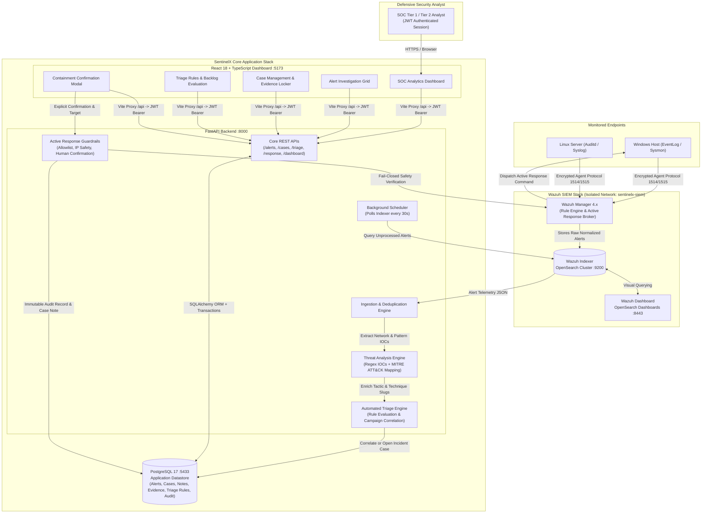

# SentinelX Architecture & Threat Processing Pipeline

SentinelX is an enterprise-grade Security Operations Center (SOC) detection, investigation, and incident response platform. It bridges production SIEM telemetry with defensive analysis workflows, automated triage, incident lifecycle management, and fail-closed host containment.

---

## 1. High-Level System Architecture

SentinelX operates across two decoupled, defense-in-depth Docker stacks:
1. **Wazuh SIEM Stack (`sentinelx-siem` network)** — Wazuh Manager, OpenSearch Indexer, and Wazuh Dashboard.
2. **SentinelX Application Stack (`sentinelx-web` & `sentinelx-data` networks)** — FastAPI backend, PostgreSQL 17 database, and React/Vite dashboard.



---

## 2. End-to-End Threat Processing Lifecycle

```text
Wazuh Agents (Windows EventChannel, Syslog)
      ↓
Wazuh Manager (Rule matching, level 0-16 calculation)
      ↓
Wazuh Indexer (OpenSearch durable alert store)
      ↓
SentinelX Background Poller (every 30s)
      ↓
Deduplication Engine (guarantees idempotent persistence by wazuh_alert_id)
      ↓
Threat Analysis Engine (RFC 1918 filter, regex IOCs: IPv4, Domain, URL, MD5/SHA256)
      ↓
MITRE ATT&CK Enrichment (Enterprise tactics & technique normalization)
      ↓
PostgreSQL Application Datastore
      ↓
Automated Triage Engine (Evaluates rule thresholds, 24-hour host campaign correlation)
      ↓
Case Management & Evidence Locker (Analyst ownership, notes, evidence promotion)
      ↓
Controlled Active Response (Fail-closed validation, human confirmation, agent containment)
```

---

## 3. Network Isolation and Defense-in-Depth Wiring

1. **Port Isolation:**
   - Wazuh Indexer OpenSearch port `9200` is **never exposed** to the host. It is reachable strictly across the internal Docker bridge network `sentinelx-siem`.
   - Wazuh Manager exposes port `55000` to the host for administrative API orchestration. The FastAPI backend communicates via `https://host.docker.internal:55000`.
   - PostgreSQL runs on host port `5433` (container port `5432`) to prevent collisions with host database installations.
   - React frontend runs on host port `5173` and communicates through Vite's reverse proxy directly to backend port `8000`.

2. **Decoupled Architecture & Graceful Degradation:**
   - If the Wazuh stack is offline, the SentinelX application remains completely operational.
   - Endpoint `/api/v1/wazuh/*` returns `502 Bad Gateway` or `503 Service Unavailable`, and the React UI displays contextual warning banners rather than crashing.

---

## 4. Active Response Safety Guardrail Architecture

SentinelX implements a strict **defense-in-depth safety pipeline** for executing host containment commands:

```text
Analyst Containment Request
    │
    ▼
1. Authentication & Role Check
    └── Requires valid JWT Bearer token with analyst or admin role.
    │
    ▼
2. Master Killswitch (RESPONSE_ENABLED)
    └── If false (default in production), terminates immediately with HTTP 403 Forbidden.
    │
    ▼
3. Command Catalog Allowlist
    └── Must strictly match approved catalog: firewall-drop, host-deny, isolate-host, quarantine, restart-wazuh.
    │
    ▼
4. Target Validation & Anti-Self-Lockout Guardrails
    ├── Reject loopback addresses (127.0.0.1, ::1, localhost)
    ├── Reject wildcard addresses (0.0.0.0, ::)
    ├── Reject multicast / broadcast ranges (224.0.0.0/4, ff00::/8)
    ├── Reject malformed IPv4 / IPv6 addresses
    └── Reject configured protected targets (RESPONSE_PROTECTED_TARGETS)
    │
    ▼
5. Explicit Human Confirmation Checkbox
    └── Front-end requires mandatory operator acknowledgement.
    │
    ▼
6. Wazuh Manager Active Response Dispatch
    └── Sends payload via authenticated Wazuh API /active-response.
    │
    ▼
7. Dual Audit Trail
    ├── Creates immutable ResponseAction database record (status, actor, output, timestamps).
    └── Appends automated [Active Response] audit entry to associated Case investigation timeline.
```
